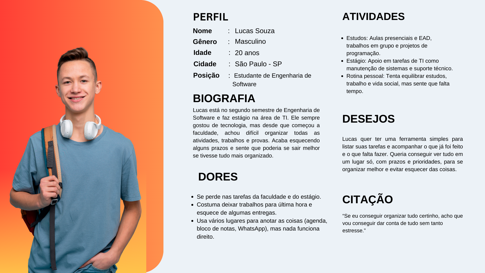
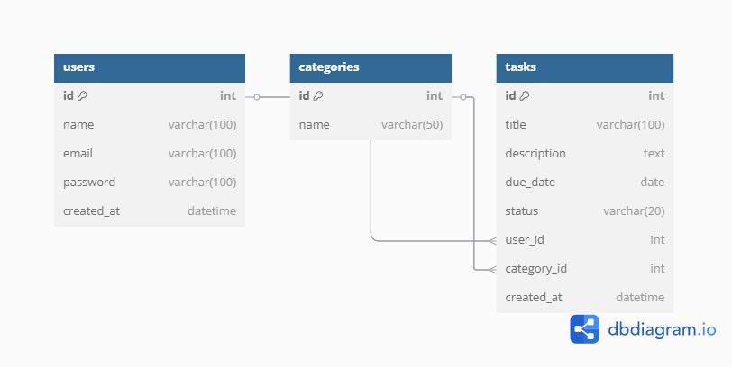
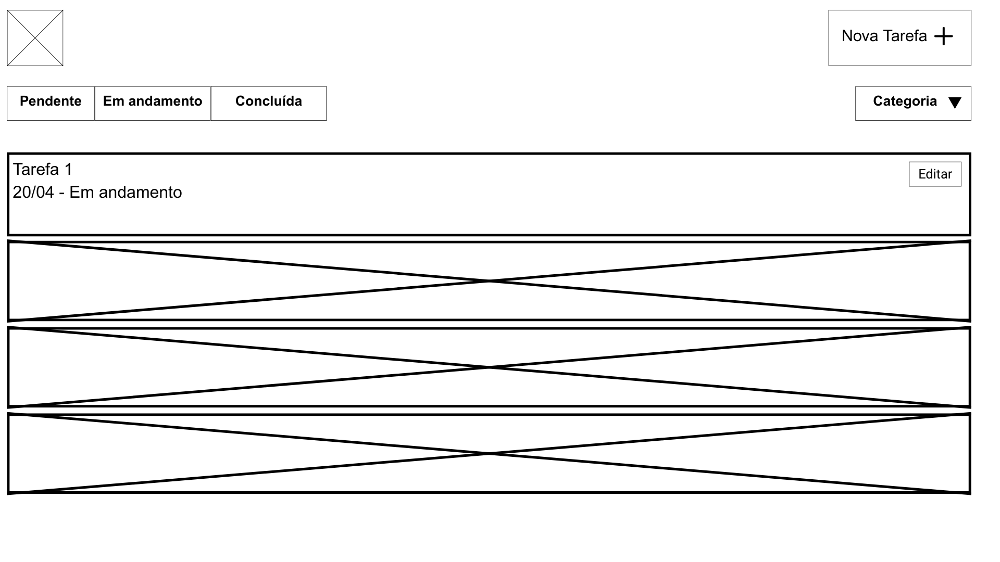
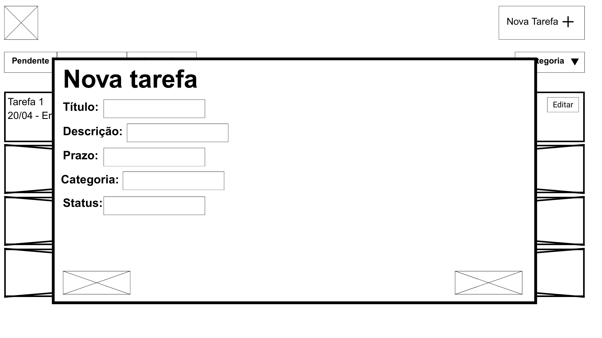
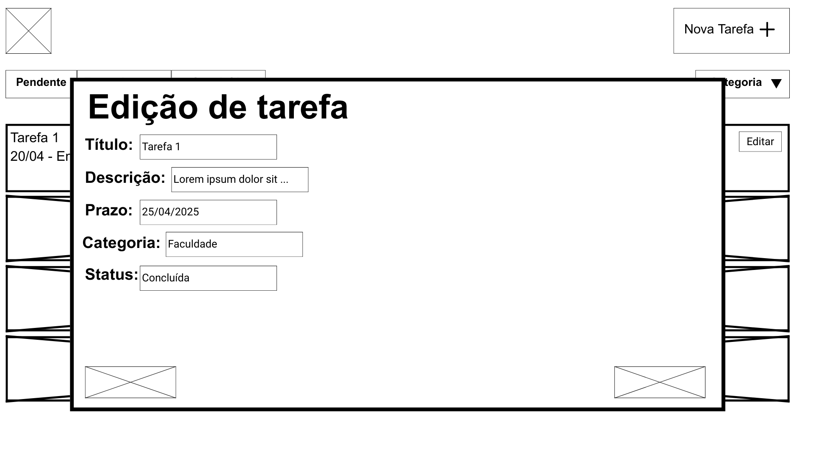
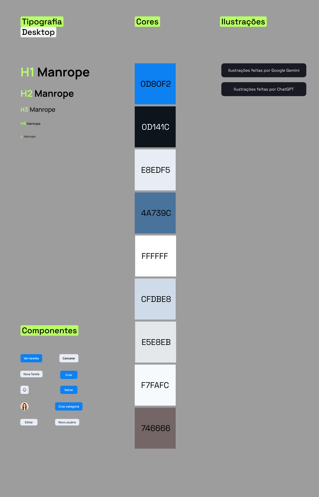
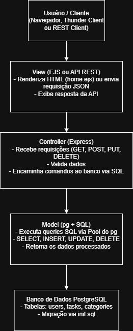

# Web Application Document - Projeto Individual - Módulo 2 - Inteli

**_Os trechos em itálico servem apenas como guia para o preenchimento da seção. Por esse motivo, não devem fazer parte da documentação final._**

## ROT

#### Giacomo Zema Matizonkas

## Sumário

1. [Introdução](#c1)  
2. [Visão Geral da Aplicação Web](#c2)  
3. [Projeto Técnico da Aplicação Web](#c3)  
4. [Desenvolvimento da Aplicação Web](#c4)  
5. [Referências](#c5)  

<br>

## <a name="c1"></a>1. Introdução 

O sistema que vou desenvolver é um Gerenciador de Tarefas para ajudar estudantes a se organizarem melhor no dia a dia. A ideia é criar uma aplicação web simples e prática, onde o usuário possa cadastrar suas tarefas, marcar prazos, acompanhar o andamento e excluir atividades já concluídas.

O foco do projeto é facilitar a vida de quem precisa lidar com várias responsabilidades ao mesmo tempo, como trabalhos de faculdade, projetos pessoais e estágios. O sistema terá um backend para armazenar os dados das tarefas e dos usuários, um frontend para o usuário interagir de forma fácil, e a comunicação entre eles será feita por meio de uma API.

O objetivo principal é entregar uma ferramenta que ajude no controle das atividades e na organização do tempo, permitindo que o usuário visualize rapidamente tudo o que precisa ser feito e evite perder prazos importantes. A construção do projeto também vai servir para colocar em prática os conceitos de desenvolvimento web estudados no módulo.

---

## <a name="c2"></a>2. Visão Geral da Aplicação Web

### 2.1. Personas 

&emsp;Segundo Page Laubheimer, especialista sênior em Experiência do Usuário no Nielsen Norman Group, personas são representações fictícias — mas que guardam características identificáveis e reais — do público alvo de determinado produto. Elas ajudam a entender melhor as dores, desejos e comportamentos dos usuários, permitindo criar soluções mais alinhadas com o que eles realmente precisam.

&emsp;Existem três tipos principais de personas: proto personas, personas qualitativas e personas estatísticas.

- A proto persona é baseada no conhecimento prévio da equipe sobre o público, sem necessidade de pesquisa de campo.
- A persona qualitativa é criada a partir de entrevistas com pequenos grupos, buscando identificar motivações e dificuldades pessoais.
- A persona estatística é baseada em dados quantitativos de uma amostra maior, normalmente mais de 100 usuários.

&emsp;No caso do projeto do Gerenciador de Tarefas, optou-se por utilizar uma **proto persona**, pois não foi realizada uma pesquisa com usuários reais. A persona foi criada a partir da vivência comum de estudantes de Engenharia de Software, identificando necessidades reais de organização de tarefas acadêmicas e pessoais.

&emsp;As informações foram baseadas em experiências típicas de alunos de graduação, considerando desafios como gerenciamento de prazos, volume de trabalhos e conciliação entre estudo e estágio. A seguir, apresentamos a persona criada:

<div align="center">
<sub>Figura 1 - Lucas Souza</sub>

<sup>Fonte: Material produzido pelo autor (2025)</sup>
</div>

&emsp;Para a persona de Lucas, as informações estão abaixo:

**Perfil:**
- Nome: Lucas Souza
- Gênero: Masculino
- Idade: 20 anos
- Cidade: São Paulo - SP
- Posição: Estudante de Engenharia de Software

**Biografia:**
- Lucas está no segundo semestre de Engenharia de Software e faz estágio na área de TI. Apesar de gostar muito da área, ele tem dificuldades para organizar sua rotina de estudos, prazos de entrega e atividades do estágio. Muitas vezes esquece trabalhos importantes e sente que isso atrapalha seu desempenho acadêmico.

**Dores:**
- Dificuldade em controlar prazos de entrega.
- Esquecimento de tarefas importantes da faculdade e do estágio.
- Falta de uma ferramenta simples para gerenciar suas atividades em um único lugar.

**Atividades:**
- Frequentar aulas presenciais e online.
- Entregar trabalhos e participar de projetos acadêmicos.
- Cumprir tarefas do estágio em tecnologia.
- Tentar equilibrar estudos, estágio e vida pessoal.

**Desejos:**
- Ter uma ferramenta simples e rápida para organizar todas as suas tarefas.
- Conseguir visualizar prazos e prioridades de forma prática.
- Reduzir o estresse causado por esquecimentos e atrasos.

**Citação:**
_"Com tudo organizado num só lugar, eu consigo focar melhor e me preocupar menos com o que posso esquecer."_as em forma de texto markdown com imagens, ou como imagem de template preenchido. Atualize esta seção ao longo do módulo se necessário.*

### 2.2. User Stories


US01 | Como estudante de Engenharia de Software, quero criar novas tarefas no sistema, para que eu possa organizar melhor meus estudos e compromissos.

US02 | Como estudante de Engenharia de Software, quero visualizar todas as minhas tarefas em uma lista, para que eu consiga acompanhar o que já foi feito e o que ainda falta.

US03 | Como estudante de Engenharia de Software, quero alterar o status de uma tarefa (pendente, em andamento ou concluída), para que eu possa gerenciar melhor o meu progresso nas atividades.

---

### Análise da US01 com base nos critérios INVEST:

**I – Independente:**  
A criação de tarefas pode ser desenvolvida separadamente das outras funcionalidades, como visualização ou edição.

**N – Negociável:**  
Podemos discutir com o professor ou colegas quais campos serão obrigatórios na criação da tarefa (por exemplo, se precisa ou não ter prazo).

**V – Valiosa:**  
Organizar tarefas é essencial para quem precisa administrar vários compromissos. Ajuda muito na produtividade do usuário.

**E – Estimável:**  
É possível estimar o esforço para implementar a criação de uma tarefa, pois envolve criar um formulário e armazenar os dados.

**S – Pequena (Small):**  
A funcionalidade é simples e focada: criar uma nova tarefa, sem misturar com outras ações mais complexas.

**T – Testável:**  
Podemos testar criando uma tarefa e verificando se ela aparece corretamente no sistema.

---

## <a name="c3"></a>3. Projeto da Aplicação Web

### 3.1. Modelagem do banco de dados (Semana 3)

#### Diagrama Relacional

Abaixo está o diagrama relacional do banco de dados desenvolvido, representando todas as tabelas e os relacionamentos entre elas. O modelo contempla os principais conceitos de normalização e integridade referencial, com uso adequado de chaves primárias (PK), chaves estrangeiras (FK) e relacionamentos 1:N e N:N quando necessário.



#### Descrição das Tabelas e Relacionamentos

- O modelo segue o paradigma relacional, com entidades bem definidas e normalizadas até, no mínimo, a 3ª Forma Normal.
- Relacionamentos do tipo **1:N** foram aplicados em entidades como `Usuário` → `Pedido`, onde um mesmo usuário pode fazer vários pedidos.
- Relações **N:N** foram resolvidas por meio de tabelas associativas, como no caso de `Produto` ↔ `Pedido`, que exigiu a criação da tabela `ItemPedido`.
- Todas as tabelas possuem atributos bem definidos, com tipos de dados apropriados e restrições de integridade para evitar inconsistências.

#### Modelo Físico (Schema SQL)

Para fins de replicação do banco, o modelo físico foi implementado e exportado em formato `.sql`, contendo todos os comandos de `CREATE TABLE`, `PRIMARY KEY`, `FOREIGN KEY` e `INSERT INTO` com dados de exemplo.

🔗 [Clique aqui para acessar o arquivo SQL](./img/modelo-banco.sql)

> O modelo foi desenvolvido com o auxílio da ferramenta SQL Designer e validado por meio de testes locais no ambiente de desenvolvimento.

### 3.1.1 BD e Models (Semana 5)
*Descreva aqui os Models implementados no sistema web*

### 3.2. Arquitetura (Semana 5)

*Posicione aqui o diagrama de arquitetura da sua solução de aplicação web. Atualize sempre que necessário.*

**Instruções para criação do diagrama de arquitetura**  
- **Model**: A camada que lida com a lógica de negócios e interage com o banco de dados.
- **View**: A camada responsável pela interface de usuário.
- **Controller**: A camada que recebe as requisições, processa as ações e atualiza o modelo e a visualização.
  
*Adicione as setas e explicações sobre como os dados fluem entre o Model, Controller e View.*

### 3.3. Wireframes
Nesta seção, apresentamos os wireframes desenvolvidos para o sistema de Gerenciamento de Tarefas proposto no Projeto Individual. O foco foi representar a estrutura e organização da interface, com base nas funcionalidades descritas nas User Stories da entrega anterior.

Os wireframes foram criados em formato desktop (landscape), visando atender ao contexto de uso da persona principal (Lucas Souza), que utiliza o sistema durante atividades acadêmicas e de estágio. A proposta visual é minimalista e estrutural, destacando os fluxos de navegação e os elementos essenciais da experiência do usuário.

<div align="center">
<sub>Figura 1 - Wireframe</sub>

<sup>Fonte: Material produzido pelo autor (2025)</sup>
</div>

Tela 1 — Listagem de Tarefas (User Story US02)

Esta é a tela principal do sistema. O usuário tem acesso rápido à visualização de suas tarefas, podendo filtrá-las por status (pendente, em andamento, concluída) ou por categoria. Cada tarefa é apresentada como um cartão simples, exibindo título, prazo e status, com um botão de edição.

### Elementos principais:
- Botão “Nova Tarefa” no topo
- Filtros por status (botões)
- Filtro por categoria (dropdown)
- Cartões com título, data e botão “Editar”


<div align="center">
<sub>Figura 2 - Wireframe</sub>

<sup>Fonte: Material produzido pelo autor (2025)</sup>
</div>


Tela 2 — Cadastro de Nova Tarefa (User Story US01)

Ao clicar em “Nova Tarefa”, o usuário visualiza um formulário modal simples com os campos essenciais para criação da tarefa: título, descrição, prazo, categoria e status inicial. A proposta é que essa criação seja rápida e objetiva.

### Campos presentes:

- Título
- Descrição
- Prazo (campo de data)
- Categoria (menu suspenso)
- Status (dropdown com opção padrão “Pendente”)

<div align="center">
<sub>Figura 3 - Wireframe</sub>

<sup>Fonte: Material produzido pelo autor (2025)</sup>
</div>

Tela 3 — Edição de Tarefa (User Story US03)

A tela de edição aparece ao clicar no botão “Editar” de qualquer tarefa listada. O formulário é exibido em um modal com os dados já preenchidos. O usuário pode alterar qualquer campo, principalmente o status da tarefa, de forma rápida.

### Campos editáveis:

- Título
- Descrição
- Prazo
- Categoria
- Status (Pendente, Em andamento, Concluída)

---

### 3.4. Guia de Estilos

Este guia de estilos tem como objetivo garantir a consistência visual e funcional da solução, servindo como referência para desenvolvedores e designers. A seguir, são apresentados os principais elementos de tipografia, paleta de cores, componentes e diretrizes visuais utilizadas no projeto.

<div align="center">
<sub>Figura  - Guia de estilo</sub>

<sup>Fonte: Material produzido pelo autor (2025)</sup>
</div>

---


#### **Componentes**

Os principais componentes da interface são padronizados e seguem a tipografia e cores acima:

- **Botões**:
  - Ver tarefas, Criar, Salvar, Criar categoria: fundo `#0D80F2`, texto branco.
  - Cancelar, Novo usuário: fundo claro com bordas discretas.
- **Formulários**:
  - Campos para criação de tarefas e novos usuários.
- **Avatares e ícones**:
  - Ícones padrão e avatares circulares.
- **Botão Editar**:
  - Estilo claro com destaque sutil.

---


#### 3.4.1. Cores

A paleta de cores da aplicação foi definida para garantir acessibilidade, consistência e clareza visual. A seguir estão os códigos hexadecimais utilizados e suas respectivas funções na interface:

| Cor       | Código Hex | Função Principal                                      |
|-----------|-------------|-------------------------------------------------------|
| Azul      | `#0D80F2`   | Cor principal para botões de ação e links            |
| Azul escuro | `#0D141C` | Fundo de componentes, contrastes fortes e textos     |
| Azul claro | `#E8EDF5`  | Fundo de seções, áreas secundárias                   |
| Azul médio | `#4A739C`  | Suporte a elementos de destaque                      |
| Branco     | `#FFFFFF`  | Fundo geral, áreas de conteúdo                       |
| Azul pálido| `#CFDBE8`  | Fundo de campos de formulário e painéis leves        |
| Cinza claro| `#E5E8EB`  | Bordas, divisórias, elementos neutros                |
| Off white  | `#F7FAFC`  | Fundo alternativo e áreas com baixa hierarquia       |
| Marrom     | `#746666`  | Texto secundário, ícones desativados, detalhes visuais|

#### 3.4.2. Tipografia

A tipografia adotada na solução tem como objetivo promover legibilidade, hierarquia visual clara e coerência entre os elementos da interface. A fonte utilizada em todo o sistema é a **Manrope**, uma fonte moderna e sem serifa (sans-serif), adequada para ambientes digitais.


| Estilo         | Fonte   | Peso        | Função                                                  |
|----------------|---------|-------------|----------------------------------------------------------|
| **H1**         | Manrope | Peso forte  | Título principal de páginas e seções                     |
| **H2**         | Manrope | Peso forte  | Subtítulo e cabeçalhos secundários                      |
| **H3**         | Manrope | Peso médio  | Cabeçalhos terciários, títulos de caixas e sessões      |
| **H4**         | Manrope | Peso leve   | Legendas ou subtítulos de menor destaque                |
| **Parágrafo (P)** | Manrope | Peso normal | Textos principais, descrições, conteúdos de formulário   |


### 3.5. Protótipo de alta fidelidade

*Posicione aqui algumas imagens demonstrativas de seu protótipo de alta fidelidade e o link para acesso ao protótipo completo (mantenha o link sempre público para visualização).*

### 3.6. WebAPI e endpoints 
O projeto segue o padrão MVC para separar responsabilidades:

- **Model**: Representado por queries SQL diretas executadas via `pg`. A modelagem das entidades está definida no script `init.sql`, com relacionamentos entre `users`, `tasks` e `categories`.

- **View**: Implementada com EJS, permitindo a renderização de uma página inicial simples acessada via a rota `/`.

- **Controller**: Arquivos JavaScript responsáveis por receber as requisições, validar os dados, executar comandos SQL e retornar a resposta adequada.

- **Rotas (Router)**: Definidas em `routes/index.js`, conectam URLs aos controllers. As rotas da API seguem o prefixo `/api`.


## Conexão com o Banco de Dados

A conexão com o PostgreSQL é realizada com o pacote `pg` e configurada via variáveis de ambiente no arquivo `.env`, garantindo segurança e portabilidade. A estrutura esperada do arquivo `.env` é:

```env
DB_HOST=localhost
DB_PORT=5432
DB_USER=seu_usuario
DB_PASSWORD=sua_senha
DB_NAME=tarefas_db
```

---

## Migração e Inicialização do Banco

A migração é feita com um script JavaScript (`migrations/migrate.js`) que executa automaticamente os comandos SQL do arquivo `init.sql`, criando todas as tabelas e constraints:

- `users`: armazena nome, e-mail e senha dos usuários
- `categories`: define categorias atribuídas às tarefas
- `tasks`: armazena título, descrição, status, prazo, usuário responsável e categoria vinculada

### Comando para rodar a migração:
```bash
npm run migrate
```

---

## API REST — Endpoints Implementados

O servidor oferece uma API RESTful com rotas que permitem gerenciar os recursos da aplicação.

### Tarefas `/api/tarefas`
- `GET /api/tarefas` — listar todas as tarefas
- `POST /api/tarefas` — criar uma nova tarefa
- `PUT /api/tarefas/:id` — editar uma tarefa existente
- `DELETE /api/tarefas/:id` — remover uma tarefa

### 👤 Usuários `/api/users`
- `GET /api/users` — listar todos os usuários
- `POST /api/users` — cadastrar novo usuário

### 🗂 Categorias `/api/categories`
- `GET /api/categories` — listar todas as categorias
- `POST /api/categories` — cadastrar nova categoria

---

## Organização do Projeto

```
meu-projeto/
│
├── config/               # Conexão com o banco (PostgreSQL)
├── controllers/          # Lógica da aplicação
├── migrations/           # Script SQL + migrador em JS
├── models/               # (opcional) representações estruturais
├── routes/               # Rotas da aplicação
├── views/                # Página inicial com EJS
├── assets/               # Estáticos (css, imagens)
├── api-testes.rest       # Arquivo para testes REST no VSCode
├── .env                  # Variáveis de ambiente (não versionado)
├── server.js             # Inicialização do servidor
└── modelo-banco.sql      # Script de criação do banco
```

---


## Diagrama de Arquitetura MVC



 Este diagrama representa a arquitetura do sistema web seguindo o padrão **MVC (Model-View-Controller)**, ilustrando o fluxo completo de dados desde o momento em que o **usuário** realiza uma requisição até a resposta final.  

> O processo inicia com o **usuário/cliente**, que pode ser um navegador acessando uma página EJS ou uma ferramenta como o Thunder Client fazendo uma requisição para a API. Essa requisição é tratada pela **View**, que renderiza uma interface (como `home.ejs`) ou encaminha os dados diretamente para o backend.

> A **camada Controller**, implementada com o framework **Express**, é responsável por receber essas requisições, validar os dados e invocar a camada Model. Ela contém a lógica de negócio da aplicação e define como cada rota deve se comportar.

> A **camada Model** não utiliza ORM. Em vez disso, executa comandos SQL diretamente via o pacote `pg`, acessando uma **pool de conexões**. Essa camada é responsável por interagir com o banco de dados, executando comandos como `SELECT`, `INSERT`, `UPDATE` e `DELETE`.

> Por fim, os dados são persistidos ou recuperados do **banco de dados PostgreSQL**, que contém as tabelas `users`, `tasks` e `categories`. As migrações de criação do banco foram realizadas com base no script `init.sql`.

> O fluxo é concluído com a **resposta sendo retornada ao usuário**, podendo ser uma página renderizada (via EJS) ou um objeto JSON com os dados solicitados pela API.


---


## Testes da API

Todos os endpoints podem ser testados utilizando:

- [✔️] Thunder Client (extensão para VSCode)
- [✔️] REST Client com o arquivo `api-testes.rest`

O arquivo `.rest` está pronto com todas as requisições (GET, POST, PUT, DELETE) e pode ser executado diretamente clicando em **"Send Request"** com a extensão instalada.
### 3.7 Interface e Navegação (Semana 7)

*Descreva e ilustre aqui o desenvolvimento do frontend do sistema web, explicando brevemente o que foi entregue em termos de código e sistema. Utilize prints de tela para ilustrar.*

---

## <a name="c4"></a>4. Desenvolvimento da Aplicação Web (Semana 8)

### 4.1 Demonstração do Sistema Web (Semana 8)

*VIDEO: Insira o link do vídeo demonstrativo nesta seção*
*Descreva e ilustre aqui o desenvolvimento do sistema web completo, explicando brevemente o que foi entregue em termos de código e sistema. Utilize prints de tela para ilustrar.*

### 4.2 Conclusões e Trabalhos Futuros (Semana 8)

*Indique pontos fortes e pontos a melhorar de maneira geral.*
*Relacione também quaisquer outras ideias que você tenha para melhorias futuras.*

---

## <a name="c5"></a>5. Referências

_Incluir as principais referências de seu projeto, para que seu parceiro possa consultar caso ele se interessar em aprofundar. Um exemplo de referência de livro e de site:_<br>

---
---
