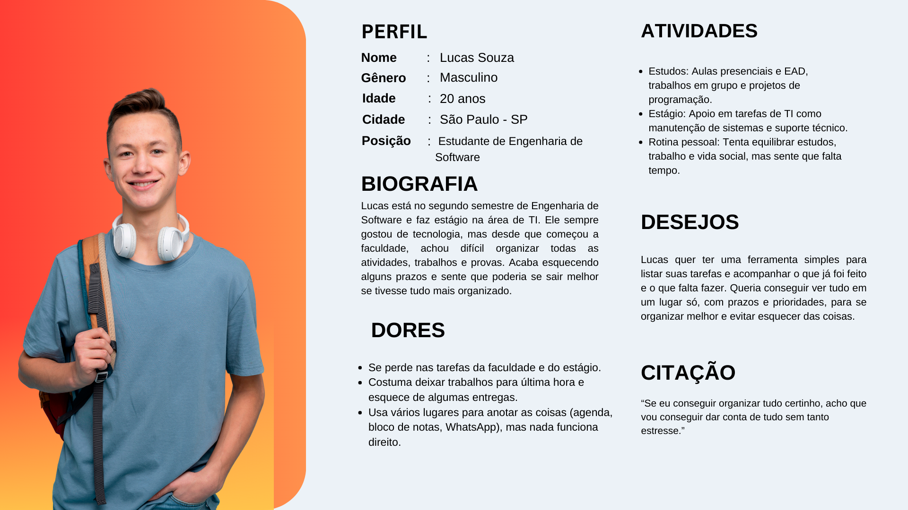

# Web Application Document - Projeto Individual - Módulo 2 - Inteli

**_Os trechos em itálico servem apenas como guia para o preenchimento da seção. Por esse motivo, não devem fazer parte da documentação final._**

## Nome do Projeto

#### Autor do projeto

## Sumário

1. [Introdução](#c1)  
2. [Visão Geral da Aplicação Web](#c2)  
3. [Projeto Técnico da Aplicação Web](#c3)  
4. [Desenvolvimento da Aplicação Web](#c4)  
5. [Referências](#c5)  

 

## 1. Introdução (semana 3)

*Preencha com até 300 palavras – sem necessidade de fonte.*

*Descreva brevemente o sistema que você irá desenvolver.*

---

## 2. Visão Geral da Aplicação Web

### 2.1. Personas 

&emsp;Segundo Page Laubheimer, especialista sênior em Experiência do Usuário no Nielsen Norman Group, personas são representações fictícias — mas que guardam características identificáveis e reais — do público alvo de determinado produto. Elas ajudam a entender melhor as dores, desejos e comportamentos dos usuários, permitindo criar soluções mais alinhadas com o que eles realmente precisam.

&emsp;Existem três tipos principais de personas: proto personas, personas qualitativas e personas estatísticas.

- A proto persona é baseada no conhecimento prévio da equipe sobre o público, sem necessidade de pesquisa de campo.
- A persona qualitativa é criada a partir de entrevistas com pequenos grupos, buscando identificar motivações e dificuldades pessoais.
- A persona estatística é baseada em dados quantitativos de uma amostra maior, normalmente mais de 100 usuários.

&emsp;No caso do projeto do Gerenciador de Tarefas, optou-se por utilizar uma **proto persona**, pois não foi realizada uma pesquisa com usuários reais. A persona foi criada a partir da vivência comum de estudantes de Engenharia de Software, identificando necessidades reais de organização de tarefas acadêmicas e pessoais.

&emsp;As informações foram baseadas em experiências típicas de alunos de graduação, considerando desafios como gerenciamento de prazos, volume de trabalhos e conciliação entre estudo e estágio. A seguir, apresentamos a persona criada:

Figura 1 - Lucas Souza

Fonte: Material produzido pelo autor (2025)

&emsp;Para a persona de Lucas, as informações estão abaixo:

**Perfil:**
- Nome: Lucas Souza
- Gênero: Masculino
- Idade: 20 anos
- Cidade: São Paulo - SP
- Posição: Estudante de Engenharia de Software

**Biografia:**
- Lucas está no segundo semestre de Engenharia de Software e faz estágio na área de TI. Apesar de gostar muito da área, ele tem dificuldades para organizar sua rotina de estudos, prazos de entrega e atividades do estágio. Muitas vezes esquece trabalhos importantes e sente que isso atrapalha seu desempenho acadêmico.

**Dores:**
- Dificuldade em controlar prazos de entrega.
- Esquecimento de tarefas importantes da faculdade e do estágio.
- Falta de uma ferramenta simples para gerenciar suas atividades em um único lugar.

**Atividades:**
- Frequentar aulas presenciais e online.
- Entregar trabalhos e participar de projetos acadêmicos.
- Cumprir tarefas do estágio em tecnologia.
- Tentar equilibrar estudos, estágio e vida pessoal.

**Desejos:**
- Ter uma ferramenta simples e rápida para organizar todas as suas tarefas.
- Conseguir visualizar prazos e prioridades de forma prática.
- Reduzir o estresse causado por esquecimentos e atrasos.

**Citação:**
_"Com tudo organizado num só lugar, eu consigo focar melhor e me preocupar menos com o que posso esquecer."_as em forma de texto markdown com imagens, ou como imagem de template preenchido. Atualize esta seção ao longo do módulo se necessário.*

### 2.2. User Stories

*Posicione aqui a lista de User Stories levantadas para o projeto. Siga o template de User Stories e utilize a mesma referência USXX no roadmap de seu quadro Kanban. Indique todas as User Stories mapeadas, mesmo aquelas que não forem implementadas ao longo do projeto. Não se esqueça de explicar o INVEST das 5 User Stories prioritárias.*

---

## 3. Projeto da Aplicação Web

### 3.1. Modelagem do banco de dados  (Semana 3)

*Posicione aqui os diagramas de modelos relacionais do seu banco de dados, apresentando todos os esquemas de tabelas e suas relações. Utilize texto para complementar suas explicações, se necessário.*

*Posicione também o modelo físico com o Schema do BD (arquivo .sql)*

### 3.1.1 BD e Models (Semana 5)
*Descreva aqui os Models implementados no sistema web*

### 3.2. Arquitetura (Semana 5)

*Posicione aqui o diagrama de arquitetura da sua solução de aplicação web. Atualize sempre que necessário.*

**Instruções para criação do diagrama de arquitetura**  
- **Model**: A camada que lida com a lógica de negócios e interage com o banco de dados.
- **View**: A camada responsável pela interface de usuário.
- **Controller**: A camada que recebe as requisições, processa as ações e atualiza o modelo e a visualização.
  
*Adicione as setas e explicações sobre como os dados fluem entre o Model, Controller e View.*

### 3.3. Wireframes

*Posicione aqui as imagens do wireframe construído para sua solução e, opcionalmente, o link para acesso (mantenha o link sempre público para visualização).*

### 3.4. Guia de estilos

*Descreva aqui orientações gerais para o leitor sobre como utilizar os componentes do guia de estilos de sua solução.*

#### 3.4.1. Cores

*Apresente aqui a paleta de cores, com seus códigos de aplicação e suas respectivas funções.*

#### 3.4.2. Tipografia

*Apresente aqui a tipografia da solução, com famílias de fontes e suas respectivas funções.*

#### 3.4.3. Iconografia e imagens 

*(esta subseção é opcional, caso não existam ícones e imagens, apague esta subseção)*

*Posicione aqui imagens e textos contendo exemplos padronizados de ícones e imagens, com seus respectivos atributos de aplicação, utilizadas na solução.*

### 3.5. Protótipo de alta fidelidade

*Posicione aqui algumas imagens demonstrativas de seu protótipo de alta fidelidade e o link para acesso ao protótipo completo (mantenha o link sempre público para visualização).*

### 3.6. WebAPI e endpoints (Semana 5)

*Utilize um link para outra página de documentação contendo a descrição completa de cada endpoint. Ou descreva aqui cada endpoint criado para seu sistema.*  

### 3.7 Interface e Navegação (Semana 7)

*Descreva e ilustre aqui o desenvolvimento do frontend do sistema web, explicando brevemente o que foi entregue em termos de código e sistema. Utilize prints de tela para ilustrar.*

---

## 4. Desenvolvimento da Aplicação Web (Semana 8)

### 4.1 Demonstração do Sistema Web (Semana 8)

*VIDEO: Insira o link do vídeo demonstrativo nesta seção*
*Descreva e ilustre aqui o desenvolvimento do sistema web completo, explicando brevemente o que foi entregue em termos de código e sistema. Utilize prints de tela para ilustrar.*

### 4.2 Conclusões e Trabalhos Futuros (Semana 8)

*Indique pontos fortes e pontos a melhorar de maneira geral.*
*Relacione também quaisquer outras ideias que você tenha para melhorias futuras.*

---

## 5. Referências

_Incluir as principais referências de seu projeto, para que seu parceiro possa consultar caso ele se interessar em aprofundar. Um exemplo de referência de livro e de site:_ 

---
---
